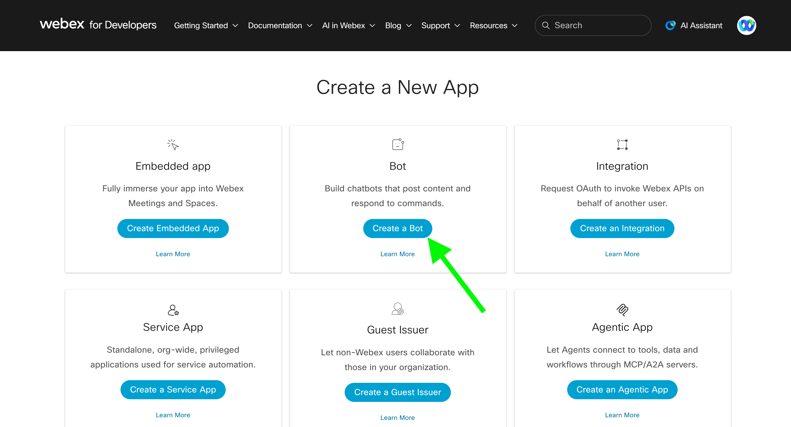
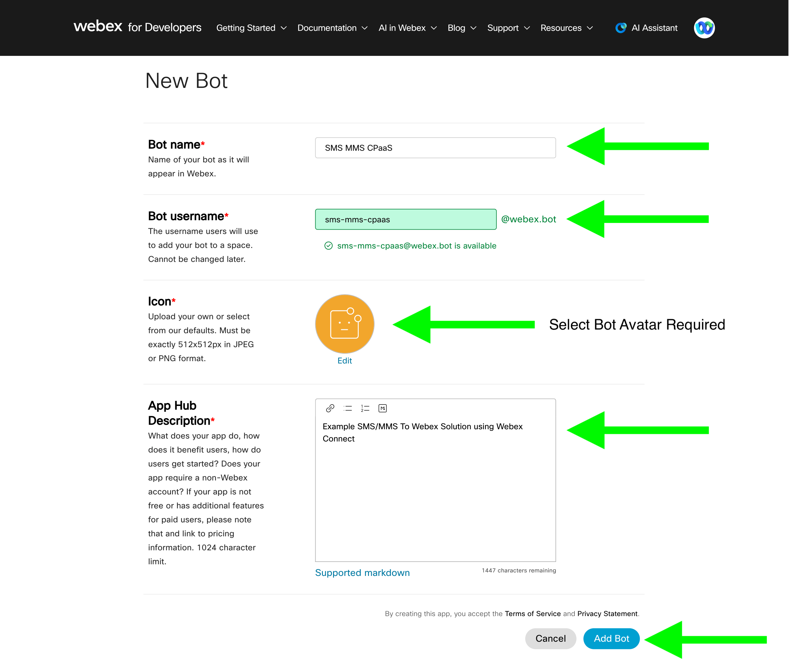
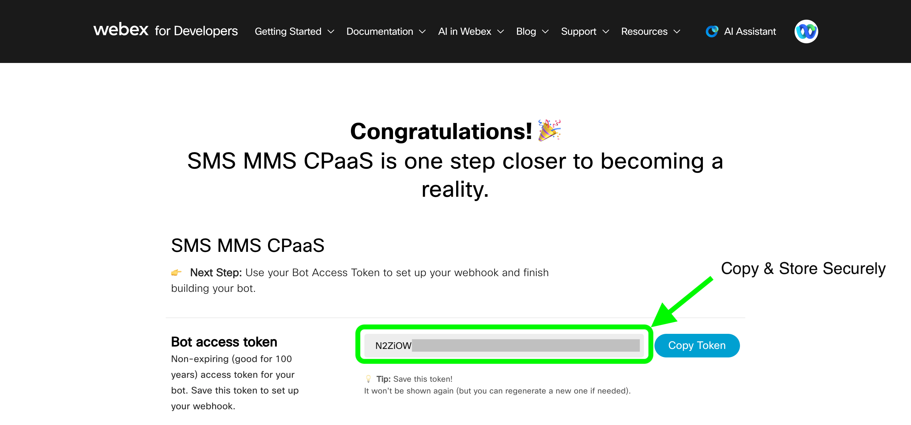

# Webex Bot Setup

<!-- step by step guide on creating a webex messaging bot via developer.webex.com -->

This bot is the identity that posts external participant messages into the Webex Space thread, and its access token is used later to register the Webex webhooks that notify Webex Connect when internal staff reply.

## Prerequisites

- A Webex account (the same login you use for the Webex App works for developer.webex.com)

## Steps

1. Go to [developer.webex.com/my-apps/new](https://developer.webex.com/my-apps/new) and sign in with your Webex account.

2. Click the **Create a Bot** button.

   
3. Fill in the bot details:
   - **Bot name** - a display name shown to space members (e.g. `SMS MMS CPaaS`)
   - **Bot username** - must be unique, forms the bot's email as `<username>@webex.bot`; cannot be changed later
   - **Icon** (required) - upload your own (must be exactly 512x512px, JPEG or PNG) or select one of the defaults
   - **App Hub Description** (required) - short description of what the bot does

   

4. Click **Add Bot**.
5. Copy the **Bot's Access Token** shown on the confirmation screen - it is only displayed once. Store it somewhere secure (e.g. a password manager or your Webex Connect environment variables/vault); it cannot be retrieved again from this screen, only regenerated.

   

   > This token is required in [4. Webex Connect Flows](../4-webex-connect-flows/README.md) (to post messages) and [5. Webex Webhook Setup](../5-webex-webhook-setup/README.md) (to create webhooks scoped to this bot).

6. Note the bot's **email address** (`<username>@webex.bot`) - you will need it to add the bot to the space in the next step.

## Next Step

Continue to [2. Webex Space Setup](../2-webex-space-setup/README.md).
