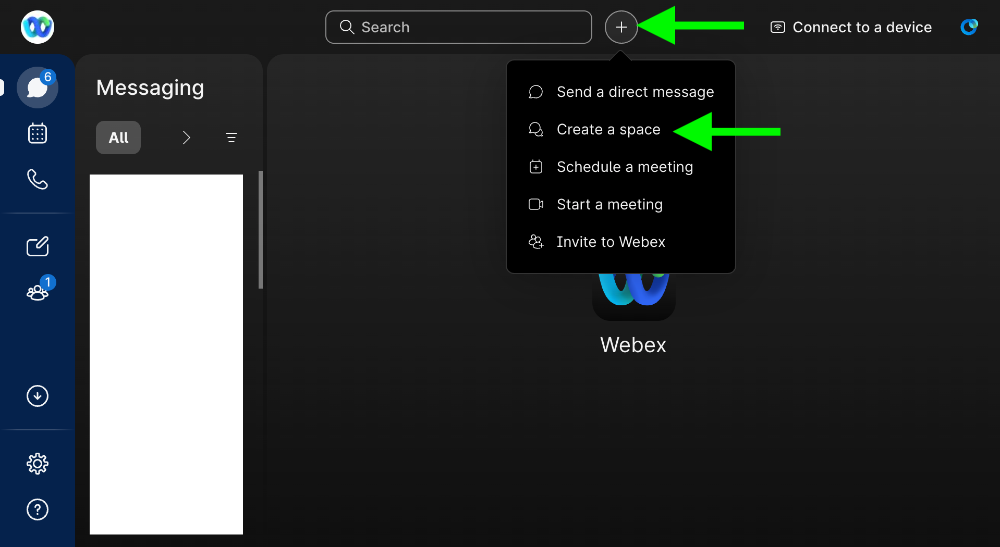
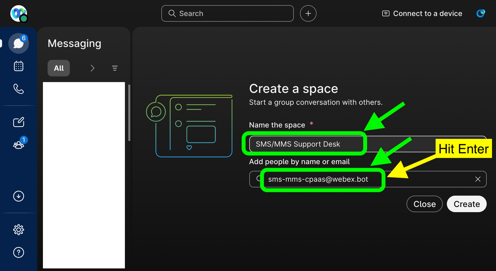
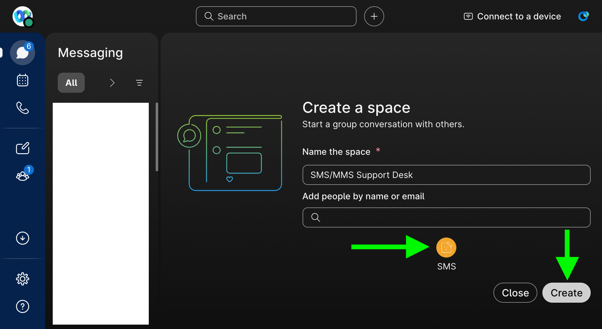
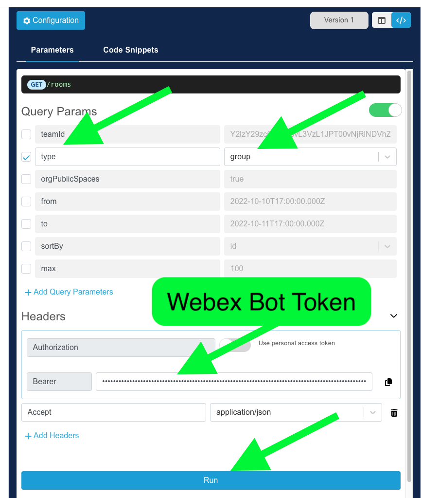
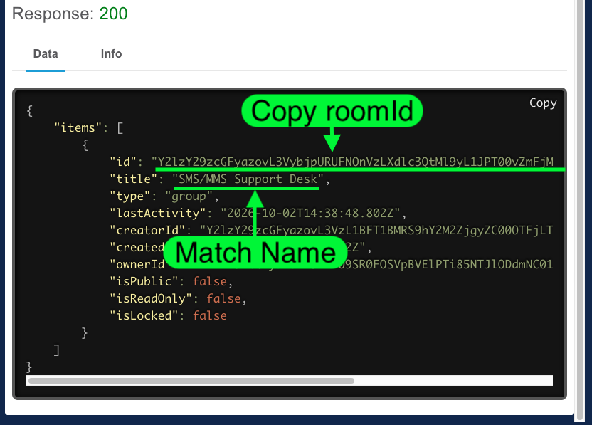

# Webex Space Setup

<!-- step by step guide on creating a webex space and add the bot and required webex memebers -->

This space is where the bot posts each external participant's conversation as a threaded message, and where internal staff reply. Each external participant's conversation should map to its own thread (parent message) within the space.

## Prerequisites

- The bot created in [1. Webex Bot Setup](../1-webex-bot-setup/README.md), and its bot email address
- Webex accounts for every internal staff member who needs to view and reply to conversations

## Steps

1. Open the Webex App (desktop, web, or mobile) signed in as the staff member who will own/administer the space.
2. Click the **+** button in the top right and select **Create a space**.

   

3. In the **Create a space** dialog, name the space (e.g. `SMS/MMS Support Desk`), then under **Add people by name or email** enter the bot's email address (`<username>@webex.bot`) from step 1 and press Enter to add it.

   

4. Using the same field, continue adding all internal staff members who need to participate in and respond to conversations, then click **Create**.

   

5. (Recommended) Restrict who can add new members to the space, since only the bot should ever be posting external conversations into it - this keeps the space limited to intended staff and avoids noise from unrelated members.
6. Capture the space's **Room ID** - this is required in [4. Webex Connect Flows](../4-webex-connect-flows/README.md) and used to scope the webhooks in [5. Webex Webhook Setup](../5-webex-webhook-setup/README.md):
   - Go to the [List Rooms API reference](https://developer.webex.com/docs/api/v1/rooms/list-rooms) on developer.webex.com and sign in.
   - Under **Query Params**, check **type** and set its value to `group` to filter the results to group spaces.
   - Under **Headers > Authorization**, paste in the bot's access token from step 1 (toggle off "Use personal access token" if it's enabled), then click **Run**.

   

   - In the response, find the space by matching its `title` to the space name, and copy its `id` value (the roomId) in full.

   

7. Store the roomId for use in the next steps.

## Next Step

Continue to [3. Webex Connect Service Setup](../3-webex-connect-service/README.md).
