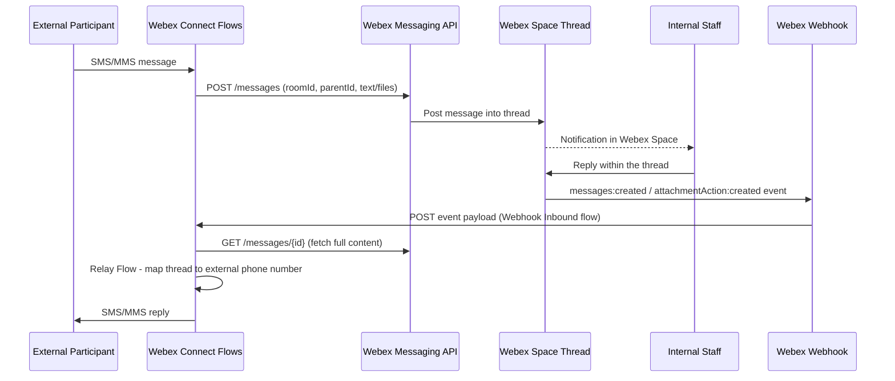

# SMS MMS Webex CPaas

This is an example SMS/MMS to Webex solution which shows how to leverage a Webex Messaging Space and Threaded messages to enable members fo the Webex Space to engage in two way conversations with external participants.

```mermaid
flowchart RL
    USER@{ shape: person, label: "External Participant<br/>SMS/MMS"}
    WEBEX_CONNECT@{ shape: cloud, label: "Webex Connect Service"}
    WEBEX_MESSAGING@{ shape: cloud, label: "Webex Messaging Service"}
    WEBEX_THREAD@{ shape: card, label: "Webex Messaging Thread"}

    subgraph STAFF [Internal Staff]
        direction LR
        STAFF_1@{ shape: person, label: "Staff"}
        STAFF_2@{ shape: person, label: "Staff"}
        STAFF_3@{ shape: person, label: "Staff"}
        STAFF_4@{ shape: person, label: "Staff"}
    end

    USER -->|1 . Inbound SMS/MMS| WEBEX_CONNECT
    WEBEX_CONNECT -->|2 . Post message to thread| WEBEX_MESSAGING
    WEBEX_MESSAGING-->|3 . Deliver| WEBEX_THREAD

    WEBEX_THREAD -->|4 . Notify & view| STAFF
    STAFF -->|5 . Reply in thread| WEBEX_THREAD
    WEBEX_THREAD -->|6 . Received | WEBEX_MESSAGING
    WEBEX_MESSAGING -->|7 . messages / attachmentAction created| WEBEX_CONNECT
    WEBEX_CONNECT -->|8 . Outbound SMS/MMS reply| USER

```


## Overview

Leveraging Webex Coonect Communication as a Service (CPaas) service flows, this solution acts as a message broker between an organisations internal Webex users and external participants which uses SMS/MMS.

- Inbound SMS/MMS Chat Sessions: New sessions trigger a new thread. Existing sessions have inbound messages appending to thread.
- Adaptive Card Bard Replies
- Automatic and Manual based session termination

### Sequence Diagram

<details>

<summary>Show Sequence Diagram</summary>



</details>

## Setup

### Prerequisites & Dependencies:

- Webex Connect Tenant with Admin access
- Webex Connect 10DLC number with SMS and MMS support, provisioned on the Webex Connect tenant
- A Webex account (used to create the bot and sign in to the Webex App / space)
- Internal staff who will respond to conversations must be members of the Webex App with access to the space
- The Webex Connect Flow endpoints (Webhook Inbound flow URL) must be publicly reachable over HTTPS so Webex can deliver webhook events to it

### Setup Steps:

Follow these steps in order - each one produces a value (token, room ID, or URL) used by a later step:

1. [Webex Bot Setup](1-webex-bot-setup/README.md) - create the bot used to post messages and authenticate webhooks
2. [Webex Space Setup](2-webex-space-setup/README.md) - create the space, add the bot & staff, capture the Room ID
3. [Webex Connect Service Setup](3-webex-connect-service/README.md) - create the Webex Connect service and assign your SMS/MMS number
4. [Webex Connect Flows](4-webex-connect-flows/README.md) - import & configure the SMS Inbound, MMS Inbound, Webhook Inbound and Relay flows
5. [Webex Webhook Setup](5-webex-webhook-setup/README.md) - create the Webex webhooks that notify the flows when staff reply

## Demo

<!-- Add a walkthrough GIF or screenshots of the end-to-end conversation here -->

<!-- Keep the following statement -->

\*For more demos & PoCs like this, check out our [Webex Labs site](https://collabtoolbox.cisco.com/webex-labs).

## License

All contents are licensed under the MIT license. Please see [license](LICENSE) for details.

## Disclaimer

Everything included is for demo and Proof of Concept purposes only. Use of the site is solely at your own risk. This site may contain links to third party content, which we do not warrant, endorse, or assume liability for. These demos are for Cisco Webex use cases, but are not Official Cisco Webex Branded demos.

## Questions

Please contact the WXSD team at [wxsd@external.cisco.com](mailto:wxsd@external.cisco.com?subject=sms-mms-webex-cpaas) for questions. Or, if you're a Cisco internal employee, reach out to us on the Webex App via our bot (globalexpert@webex.bot). In the "Engagement Type" field, choose the "API/SDK Proof of Concept Integration Development" option to make sure you reach our team.
